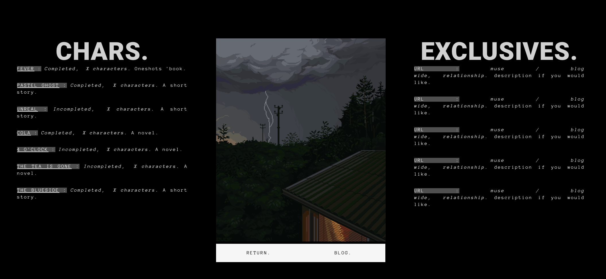

<p align="center">
  
</p>

<h1 align="center">
  pufficats.me - v1
</h1>
<p align="center">
  The first iteration of <a href="https://pufficats.me" target="_blank">pufficats.me</a> (wip!) built with React.js leveraging Material UI.
</p>



## 🛠 set-up

1. Install the dependencies

   ```sh
   npm install or yarn
   ```

2. Start the development server

   ```sh
   npm run start
   ```

## 🚀 build and run for production

1. Generate a full static production build

   ```sh
   npm run build
   ```


## 🎨 color codes
| Color          | Hex                                                                |
| -------------- | ------------------------------------------------------------------ |
| Navy           |  `#f7f7f7` |
| Light Navy     |  `#dfdfdf` |
| Lightest Navy  |  `#999999` |
| Slate          |  `#888888` |
| Light Slate    |  `#7b7b7b` |
| Lightest Slate |  `#676767` |
| White          |  `#545454` |
| Green          |  `#363636` |